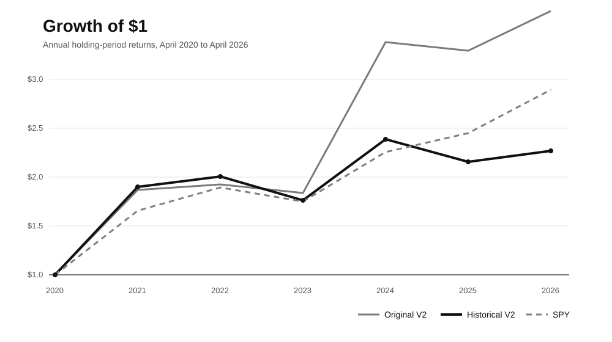
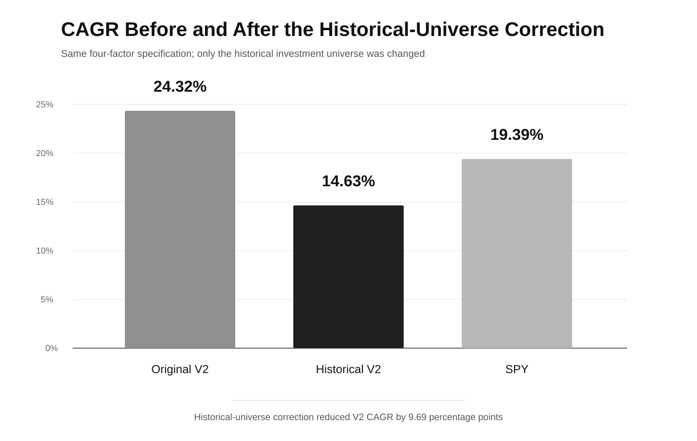
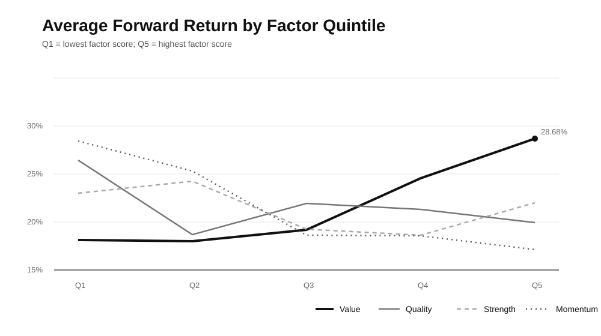

# Multi-Factor Equity Research & Backtesting

Testing whether a sector-relative combination of Value, Quality, Financial Strength and Momentum can outperform the S&P 500 once the backtest is corrected for historical index membership.

**Python · SEC EDGAR / XBRL · Historical S&P 500 Constituents · April 2020 to April 2026**

**[View the portfolio page →](https://melodious-pendulum-9e4.notion.site/Multi-Factor-Equity-Research-Backtesting-3bfb69512230800c939bc5d42d278583)**

## At a glance

| Metric | Historical V2 | SPY |
| --- | ---: | ---: |
| CAGR | **14.63%** | **19.39%** |
| Final value of $1 | $2.269 | $2.896 |
| Annual volatility | 38.72% | 24.71% |
| Sharpe ratio | 0.49 | 0.86 |
| Periods outperforming SPY | 2 / 6 | 4 / 6 |

The first four-factor backtest produced a **24.32% CAGR**. After reconstructing historical S&P 500 membership and rerunning the same specification, CAGR fell to **14.63%**, below SPY's **19.39%**. That change became the central finding of the project.

## Research question

Can a transparent, sector-relative multi-factor model identify S&P 500 stocks that outperform SPY when the investment universe and accounting information are treated as historical data rather than current data?

The model ranks eligible stocks within sector and combines four signals:

| Factor | Main input | Higher score represents |
| --- | --- | --- |
| Value | Historical trailing P/E | Lower valuation |
| Quality | Operating margin and ROE | Higher profitability |
| Financial Strength | Debt-to-equity | Lower leverage |
| Momentum | Trailing 12-month return | Stronger prior performance |

At each annual April rebalance, the 20 highest-ranked eligible stocks form an equal-weight portfolio. Financials are excluded because conventional operating margin and debt-to-equity are not directly comparable with bank and insurer balance sheets.

## Why the original result changed

The first version used companies that are members of the S&P 500 today. For a historical test, that introduces information about which companies survived or entered the index later.

In the April 2020 comparison:

- 111 index members were no longer in the current universe.
- 115 current constituents had not yet entered the index.
- Only 388 names appeared in both sets.

I rebuilt date-specific S&P 500 universes, expanded historical price and sector coverage for former constituents, and reran the **same factor definitions and equal weights**.

### Corrected annual returns

| Period | Historical V2 | SPY | Excess return |
| --- | ---: | ---: | ---: |
| 2020–2021 | **90.12%** | 65.36% | **+24.76%** |
| 2021–2022 | 5.65% | 14.55% | -8.90% |
| 2022–2023 | -12.25% | -7.73% | -4.52% |
| 2023–2024 | **35.49%** | 28.90% | **+6.59%** |
| 2024–2025 | -9.57% | 8.80% | -18.37% |
| 2025–2026 | 5.06% | 18.14% | -13.08% |

## Factor diagnostics

I also tested the factors individually using **1,759 stock-year observations**.

| Factor | Pooled Spearman IC | IC excluding 2020 |
| --- | ---: | ---: |
| **Value** | **+0.034** | +0.012 |
| Quality | +0.003 | +0.014 |
| Momentum | -0.022 | -0.001 |
| Financial Strength | -0.025 | -0.032 |

Value was the clearest individual signal. Its average subsequent return increased from **18.11% in the lowest factor-score quintile to 28.68% in the highest**.

## Robustness checks

The original V2 was also tested using Top 10, Top 20 and Top 30 portfolios. Smaller portfolios generated higher returns but also materially higher volatility. Top 20 remained the main specification rather than selecting the highest-return cutoff after observing the results.

I also audited the unusually strong 2023–2024 result. SMCI returned approximately 820% over that holding period. Raw and adjusted prices produced the same return, and its later stock split occurred outside the holding period. Removing SMCI reduced the portfolio return from 84.17% to 45.43%.

## Main conclusion

The project does **not** support the claim that this four-factor strategy consistently beats the S&P 500. After the historical-universe correction, the model produced a lower CAGR, higher volatility and lower Sharpe ratio than SPY.

The more useful result was methodological: a backtest that initially looked strong changed materially when historical membership, filing timing, stock splits and missing observations were examined more carefully. Among the four simple signals, sector-relative Value showed the strongest cross-sectional relationship with subsequent returns over this sample.

## Repository contents

- [`multifactor_equity_research_github.ipynb`](multifactor_equity_research_github.ipynb) — complete Python research workflow
- [`report/research_note.md`](report/research_note.md) — concise written research note
- [`figures/`](figures/) — selected result figures
- [`requirements.txt`](requirements.txt) — Python package list

## Limitations

This is an independent research project, not an investable trading strategy. The sample contains only six annual holding periods. Historical coverage is incomplete for some former constituents. Transaction costs, taxes and market impact are not included. The Sharpe ratio is based on a small number of annual observations. Historical membership reconstruction materially reduces future-membership bias, but the backtest is not described as perfectly survivorship-bias-free.

## Author

**Fiona Rramilli**  
MSc Finance, University of Neuchâtel

Independent applied equity research and Python backtesting project, 2026.